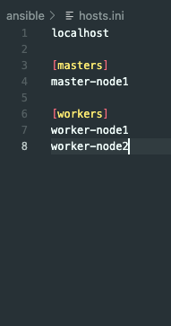

# Simple playbook to spin up microk8s on any plattform !

# Instructions

This simple Ansible-Playbook creates a [microk8s](https://microk8s.io/)-Cluster with custom amount of nodes. 

You can run this playbook anywhere you want: locally, on-premise (for exampple Proxmox or vCenter) or on cloud instances (AWS, Azure or GCP).

## Prerequisites:

  - Ansible installed on your local machine/control node
  - SSH-access on your machines
  - [snapd](https://snapcraft.io/) installed on your hosts and running
  - user for previlige escalation on your hosts
  
For the underlying OS of the nodes, I recommend Ubuntu or Debian- based operating systems. 

### Note on cloud instances !

Please make sure that your VPC's allow to the following [ports](https://microk8s.io/docs/services-and-ports) on the nodes to access the microk8s-services (i.E. you SecurityGroups etc.). 

##  Fill in your inventory file

Your Kubernetes-Nodes/Hosts should be grouped into masters and workers.

Localhost should also be in your hosts file

Example:



## Run the Playbook

```
 ansible-playbook -i ansible/[YOUR-HOSTS-FILE] ansible/reset.yaml  --private-key=[YOUR-SSH-KEY] --user=[USERNAME]
```

With previlige escalation (depending how you're coennecting to your hosts):

```
ansible-playbook -i ansible/[YOUR-HOSTS-FILE] ansible/reset.yaml  --private-key=[YOUR-SSH-KEY] --become --user=[USERNAME] --ask-pass
```

or

```
ansible-playbook -i ansible/example-hosts.ini ansible/reset.yaml  --private-key=[YOUR-SSH-KEY] --become --user=[USERNAME]  --ask-become-pass
```

The kubeconfig-file will be written directly under you `./kube` directory.


#### Single-Node

If you simply want to deploy a single-node cluster

```
ansible-playbook  --inventory [Hostname/IP-Address],  ansible/site.yaml --ask-become-pass
``` 

Locally:

```
ansible-playbook  --connection=local --inventory 127.0.0.1,  ansible/site.yaml --ask-become-pass       
``` 

### NOTE !

Please don't use this repository for large enterprise- or production environments !

### Feel free to contribute to this project for further improvements !
